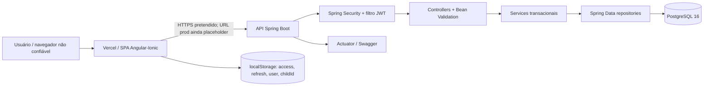
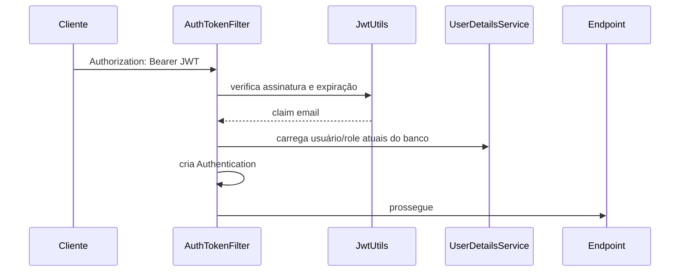
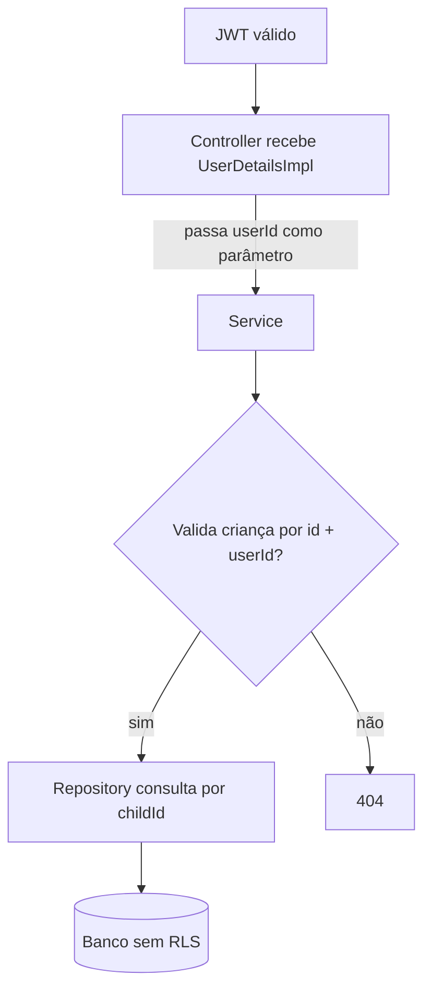
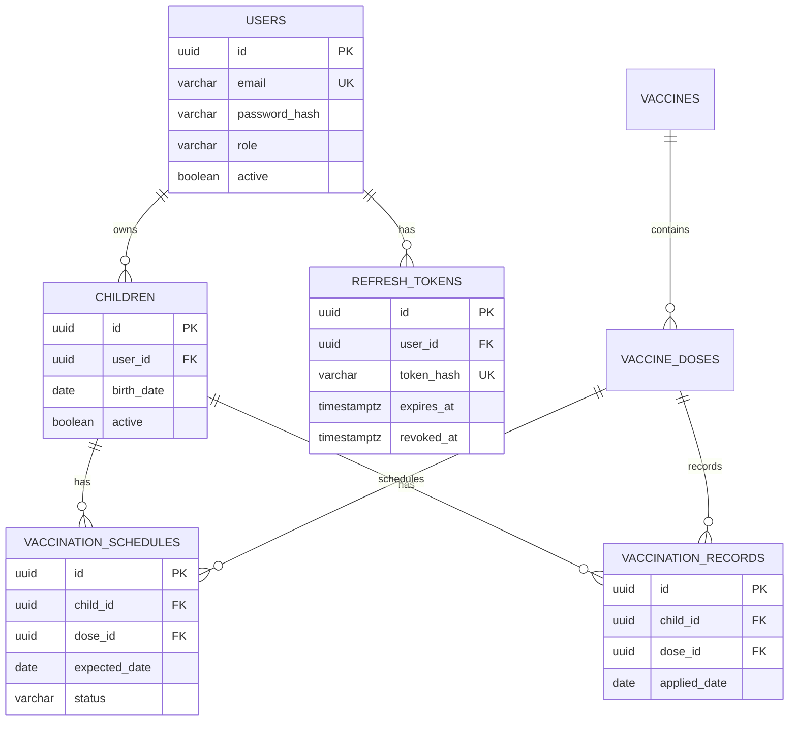

# Arquitetura atual

## Visão de execução



O frontend de produção publicado não está conectado a uma URL real de backend no código auditado. O Compose inicia somente PostgreSQL; backend e frontend não formam uma stack Docker completa.

## Fluxo de autenticação atual

```mermaid
sequenceDiagram
    participant B as Navegador
    participant A as AuthController
    participant S as AuthService
    participant DB as PostgreSQL

    B->>A: POST /auth/login (email, senha)
    A->>S: login DTO validado
    S->>DB: usuário por email
    S->>S: BCrypt via AuthenticationManager
    S->>S: JWT HMAC (sub=id, email, iat, exp)
    S->>S: UUID aleatório como refresh; SHA-256
    S->>DB: grava somente token_hash
    S-->>B: accessToken + refreshToken no JSON
    B->>B: grava ambos em localStorage
```

No refresh, o backend busca o hash, verifica expiração/revogação, revoga o token antigo e cria outro. Não há família de tokens, detecção de reutilização nem trava contra duas renovações simultâneas. O frontend não chama `/refresh`.

## Autenticação de cada request



Ponto positivo: role é recarregada do banco e não confiada ao frontend. Lacuna: o filtro cria autenticação mesmo quando `UserDetails.isEnabled()` é falso; um access token emitido antes da desativação pode continuar aceito até expirar.

## Fluxo de autorização de dados privados



Controllers de criança extraem o ID do principal e os repositories de criança filtram por usuário. Calendário e registros validam a criança primeiro e depois consultam por `childId`. Services, porém, aceitam qualquer `userId` fornecido pelo chamador e o banco não oferece RLS; uma chamada interna incorreta não possui segunda barreira independente.

## Modelo de dados



`campaigns` é independente e possui `CHECK (end_date >= start_date)`.

## Contrato frontend versus backend

| Fluxo | Frontend atual | Backend real | Resultado esperado |
|---|---|---|---|
| Criança | envia `gender`, não envia `responsibleName` | exige `responsibleName` | 400 |
| Agenda | `/vaccination-schedules/child/{id}` | `/children/{id}/vaccination-schedule` | 401/404 conforme segurança/rota; não integra |
| Resumo | `/vaccination-schedules/child/{id}/summary` | `/children/{id}/vaccination-summary` | não integra |
| Histórico | `/vaccination-records/child/{id}` | `/children/{id}/records` | não integra |
| Registrar dose | body contém `childId`, `vaccineId`, `notes` | childId no path; body `doseId`, `appliedDate`, `location`, `batchNumber`, `observations` | não integra |
| Produção | `sua-api-producao.com` | nenhuma URL registrada | frontend sem backend válido |
