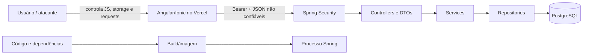

# Arquitetura de segurança atual

> Estado observado na Fase 0 em 22/07/2026. Este documento descreve controles e lacunas; não certifica o sistema como seguro.

## Princípio de confiança

O navegador, o frontend, o AuthGuard, o storage, URLs, headers, JSON, IDs e roles enviados pelo cliente são não confiáveis. A autorização efetiva deve ocorrer no backend e a integridade/segregação deve ter barreiras adicionais no PostgreSQL.

## Fluxo e fronteiras

No estado atual, somente as primeiras barreiras do backend existem de forma parcial. Repositories e PostgreSQL não limitam independentemente uma consulta privada incorreta.

## Autenticação

- Cadastro comum fixa `Role.USER` no service.
- Senhas usam BCrypt.
- Login emite JWT HMAC com `sub`, `email`, `iat` e `exp`.
- A role não é lida do frontend nem gravada no JWT; é recarregada do banco a cada request.
- Refresh token é UUID aleatório, persistido somente como SHA-256, com expiração/revogação e rotação simples.

Lacunas:

- Frontend grava access e refresh em `localStorage`.
- Interceptor envia Bearer a qualquer URL absoluta, não à origem exata da API.
- Frontend não renova nem revoga sessão no backend no logout.
- JWT não valida issuer, audience ou tipo e não tem jti.
- Usuário desativado não é rejeitado explicitamente pelo filtro JWT.
- Refresh não possui família, reuse detection ou proteção comprovada contra corrida.
- Não há rate limit.
- Uma mudança CORS concorrente ainda não commitada passou em probes de origem permitida/maliciosa, mas o profile prod depende de `APP_CORS_ALLOWED_ORIGINS`; CORS continua não sendo autenticação.

## Autorização

- `/api/v1/admin/**` exige `ROLE_ADMIN` na cadeia.
- `AdminCampaignController` possui `@PreAuthorize("hasRole('ADMIN')")`.
- Demais requests exigem autenticação, exceto auth, Actuator e Swagger explicitamente liberados.
- Controllers privados obtêm `UserDetailsImpl` e passam seu UUID ao service.
- `ChildRepository` consulta por `id + userId`; agenda/registro validam a criança antes da consulta por childId.

Lacunas:

- Services aceitam `userId` como parâmetro em vez de obter a identidade autenticada.
- Services administrativos não possuem proteção de método.
- Repositories de agenda/registro não incluem owner em suas assinaturas.
- PostgreSQL não possui RLS.
- O role runtime é superuser/owner/BYPASSRLS.

## Dados e contratos

Controllers retornam DTOs, não entidades JPA. DTOs de criação não aceitam owner/user/role. Bean Validation cobre nome, email, senha, datas futuras de criança/aplicação e datas de campanha no domínio.

Ainda faltam rejeição explícita de propriedades desconhecidas, limites em strings de registro, paginação máxima, allowlist de sort e constraints SQL de role/status/data. O frontend recém-integrado usa contratos e paths incompatíveis com a API.

## Edge e browser

O frontend publicado respondeu por HTTPS com HSTS. Não foram observados CSP, `frame-ancestors`/X-Frame-Options, `Referrer-Policy`, `Permissions-Policy` ou `X-Content-Type-Options`; o edge revelou `Server: Vercel` e `Access-Control-Allow-Origin: *`.

Nenhum sink Angular explícito (`innerHTML`, `DomSanitizer`, `bypassSecurityTrust*`, `javascript:`) foi encontrado. Isso reduz, mas não elimina, risco XSS e não torna `localStorage` seguro.

## Infraestrutura e cadeia de suprimentos

- Dockerfile backend é multi-stage, mas a imagem final roda como root, é gravável e não tem healthcheck.
- Compose publica PostgreSQL em todas as interfaces e usa o mesmo superuser para runtime/migrations/owner.
- Não há backend no Compose nem rede interna completa.
- Não há CI/CD, Dependabot, CodeQL, secret scanner, image scanner ou SBOM.
- `npm audit` encontrou 22 vulnerabilidades na árvore completa, uma crítica.
- O commit concorrente `8e0fa55` versionou segredo JWT/credencial local e o build confirmou ambos no JAR; deploy/push está bloqueado por F0-031.

## Observabilidade e recuperação

O handler genérico não devolve stack trace. Não foi encontrado log de tokens, mas também não existem correlation ID, logs estruturados, eventos de segurança, trilha de auditoria, alertas, backup automático ou teste de restauração.

## Matriz atual de independência

| Falha simulada | Barreira atual | Segunda barreira independente | Estado |
|---|---|---|---|
| frontend/guard ignorado | Spring Security retorna 401 | N/A | parcial |
| USER chama admin | rota + `@PreAuthorize` no controller | service sem regra | parcial |
| controller passa child de outra conta | service valida child+user | DB sem RLS | parcial |
| service consulta agenda/record sem owner | nenhuma no banco | nenhuma | falha |
| aplicação persiste campanha inválida | service + CHECK | duas camadas | atende esse caso |
| aplicação persiste role/status/data inválidos | constraints ausentes | nenhuma | falha |
| dependência vulnerável entra | `npm audit` manual | CI ausente | falha |
| processo de aplicação comprometido | container root + DB superuser | nenhuma redução relevante | falha |

O mapa completo está em `.planning/codebase/ARCHITECTURE.md` e o registro de riscos em `.planning/codebase/CONCERNS.md`.
