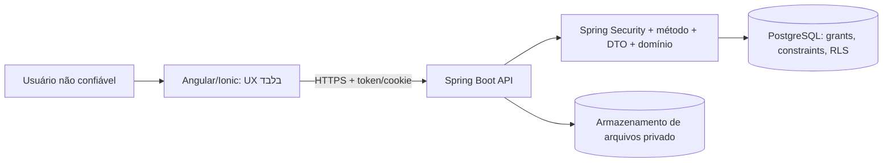
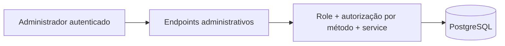
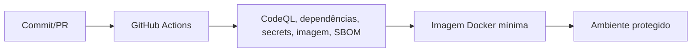

# Modelo de ameaças — Vacina Kids

## Escopo e fronteiras de confiança

O sistema trata contas, responsáveis, crianças, calendário vacinal, registros de doses, campanhas e eventuais comprovantes. O navegador, frontend Angular/Ionic, localStorage/sessionStorage, cookies antes de validação, JSON, parâmetros de URL, headers, arquivos, APIs externas e dados originalmente enviados pelo usuário são não confiáveis. Spring Security autentica; controllers/DTOs validam contrato; services impõem propriedade e domínio; repositories restringem consultas; PostgreSQL aplica constraints e deverá aplicar RLS; edge, containers, CI, logs e backups reduzem impacto e detectam abuso.

## Fluxos de confiança

## Casos de abuso e análise

| ID | Abuso | Prob. | Impacto | Controles preventivos (planejados) | Detecção/evidência | Residual atual |
|---|---|---:|---:|---|---|---|
| TM-01 | A acessa criança B | Alta | Crítico | Security, service owner, repository owner, RLS | 403/404, auditoria, teste cross-account | Alto: filtros/RLS ainda não comprovados |
| TM-02 | A registra dose de B | Alta | Crítico | Service transacional, repository, FK/RLS | teste negativo + evento | Alto |
| TM-03 | `userId`/`ownerId` adulterado | Alta | Alto | DTO sem campo, Authentication, service | rejeição 400/403 + logs | Alto |
| TM-04 | Role visual alterada para ADMIN | Alta | Crítico | assinatura JWT, rota, `@PreAuthorize`, service | 401/403 + evento | Alto |
| TM-05 | Endpoint admin chamado diretamente | Alta | Crítico | default deny, role e método | 401/403 + rate limit | Alto |
| TM-06 | Refresh token reutilizado | Alta | Crítico | hash, rotação, família, revogação | evento reuse + revogação | Alto |
| TM-07 | Payload com campos extras/HTML | Alta | Alto | DTO allowlist, Bean Validation, sanitização/CSP | 400, logs sanitizados, scanner | Alto |
| TM-08 | Data futura/enum/tamanho inválido | Média | Médio | DTO + domínio + CHECK | 400/constraint + teste | Médio |
| TM-09 | SQL injection/ordenação maliciosa | Média | Crítico | queries parametrizadas, allowlist, grants/RLS | testes SAST/DAST + logs | Alto |
| TM-10 | Duplicidade por requisições simultâneas | Média | Alto | transação + UNIQUE | teste concorrente + constraint | Alto |
| TM-11 | Brute force/repetição crítica | Alta | Alto | rate limit interno/edge, lockout, idempotência | métricas e eventos | Alto |
| TM-12 | Comprovante de outra conta | Média | Alto | autorização de download, path privado, RLS | evento + teste cross-account | Alto |
| TM-13 | Consulta repository sem owner | Média | Crítico | métodos privados, RLS FORCE, grants | teste proposital + alerta | Crítico: RLS ausente |
| TM-14 | Segredo no Git/imagem | Alta | Crítico | secret scan, revisão, runtime secrets, rotação | pipeline bloqueia + inventário | Crítico: F0-031 confirmado |
| TM-15 | Dependência vulnerável | Média | Alto | Dependabot, SCA, CodeQL, gate CVE | artefato de CI | Alto: scanners ausentes |
| TM-16 | Container comprometido | Média | Crítico | non-root, cap drop, read-only, limites, DB privado | scan/runtime probe | Alto: imagem atual root/grava |
| TM-17 | Log injection/vazamento | Média | Alto | logger estruturado, redaction, limites | teste de logs + alertas | Alto |
| TM-18 | Backup não recuperável | Baixa | Crítico | backup criptografado, cópia externa, restore testado | relatório RPO/RTO | Alto |

## Requisitos de três camadas para riscos críticos

| Risco | Camada 1 | Camada 2 | Camada 3 |
|---|---|---|---|
| Acesso cruzado | Spring Security/método | service/repository por proprietário | PostgreSQL RLS + FK/constraints |
| Escalonamento ADMIN | JWT assinado/issuer/audience | rota + `@PreAuthorize` | service + auditoria |
| Token reutilizado | cookie/transport seguro | hash + rotação/família | revogação + rate limit + evento |
| Consulta sem owner | repository seguro | transação/contexto de usuário | RLS FORCE + grants mínimos |
| Segredo/dependência | revisão/PR | secret/SCA/CodeQL gates | imagem mínima + runtime secrets |
| Compromisso de container | non-root | capabilities/FS/limites | banco privado + role sem BYPASSRLS |

## Risco residual e próximos testes

Este documento não declara controles implementados. Os testes de defesa entre camadas, isolamento por usuário, RLS, tokens, scanners, container e restore serão executados nas fases 3–13. O achado F0-031 bloqueia deploy e push até remoção e rotação autorizadas.
